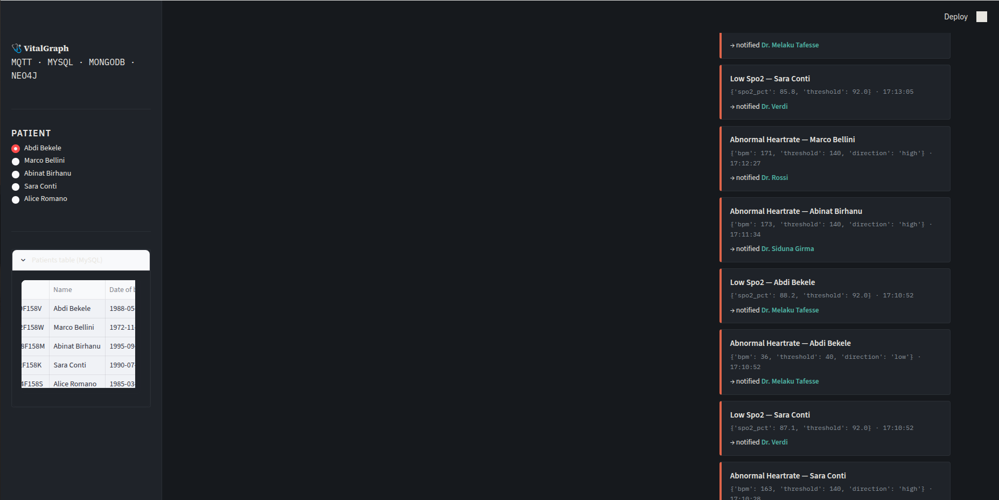
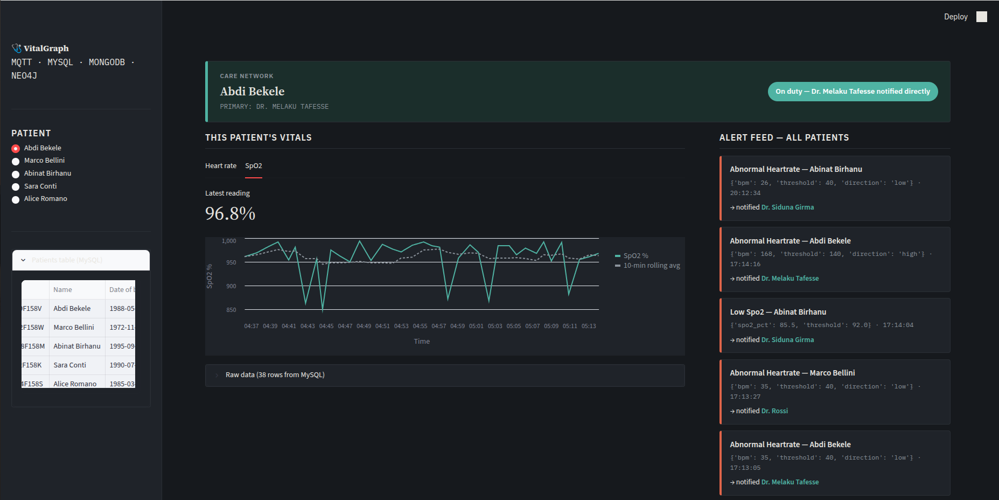
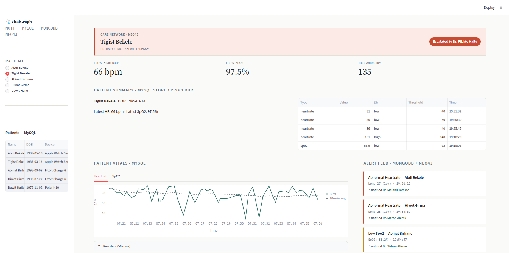

# VitalGraph

Health monitoring platform for the DB-B8 (Health & Wellness) track — Database Management Systems, Module B, University of Messina.

Simulated wearable devices publish vital signs over MQTT. A Python subscriber routes each message to the database best suited for that type of data: MySQL for structured time-series, MongoDB for variable-structure alerts and device metadata, and Neo4j for the care network. When a reading crosses an anomaly threshold, the subscriber queries Neo4j live to resolve which doctor to notify, walking a backup chain of up to two hops if the primary doctor is unavailable.


## What the system does

- Five patients with real wearable device brands (Apple Watch Series 9, Fitbit Charge 6, Polar H10)
- Six doctors with backup coverage chains at depth 0, 1, and 2
- MySQL trigger automatically logs anomalies to `anomaly_log` independent of Python code
- MySQL view (`patient_vitals_summary`) joins latest vitals and anomaly counts per patient
- MySQL stored procedure (`get_patient_summary`) returns full patient summary in one call
- MySQL archive procedure (`archive_old_readings`) moves old readings automatically every 30 minutes
- MongoDB aggregation pipeline for alert statistics per patient
- MongoDB TTL index expires alert documents after 30 days
- Neo4j escalation query resolves the correct doctor in 2-5 ms
- Cross-database query: Neo4j finds patients sharing a device type, MongoDB checks if their alerts clustered in time
- Live performance panel on the dashboard showing query times and record counts

## Screenshots

When Tigist Bekele's reading fires, the subscriber walks two hops through the backup chain to Dr. Fikirte Hailu:


Alert feed showing all patients, each routed to the correct doctor:



Heart rate and SpO2 charts with 10-minute rolling average:



System-wide panels: on-call doctors, alert statistics, anomaly log, device metadata, device correlation:



## Getting started

```bash
cp .env.example .env
docker compose up -d
```

MySQL and MongoDB seed themselves on first start. Neo4j requires a manual seed step:

```bash
./db/neo4j/load_seed.sh
```

Do not run this twice without wiping the volume first. The seed uses `CREATE` which does not deduplicate, so re-running creates duplicate nodes.

## Running

```bash
python3 -m venv .venv
source .venv/bin/activate
pip install -r requirements.txt
```

Three terminals:

```bash
# terminal 1
python router/subscriber.py

# terminal 2
python publisher/publisher.py

# terminal 3
streamlit run dashboard_app.py
```

Dashboard opens at `http://localhost:8501`.

FastAPI backend (optional, for REST/WebSocket access):

```bash
uvicorn api.main:app --reload --port 8000
```

## Verifying it works

```bash
docker compose ps

docker exec -it vitalgraph-mysql mysql -u vitaluser -pvitalpass vitalgraph \
  -e "SELECT * FROM patient_vitals_summary;"

docker exec -it vitalgraph-mysql mysql -u vitaluser -pvitalpass vitalgraph \
  -e "SHOW TRIGGERS;"

docker exec -it vitalgraph-mongo mongosh -u vitaluser -p vitalpass \
  --authenticationDatabase admin vitalgraph \
  --eval "db.alerts.countDocuments()"
```

Neo4j Browser: `http://localhost:7474` (neo4j / vitalpass123)

Run the escalation query for Tigist Bekele:
```cypher
MATCH (p:Patient {id: 'BKLTST85C54F158P'})-[:MONITORED_BY]->(primary:Doctor)
OPTIONAL MATCH path = (available:Doctor {on_duty: true})-[:BACKUP_FOR*0..3]->(primary)
RETURN primary.name, primary.on_duty, coalesce(available.name, primary.name) AS notified, length(path) AS chain_depth
ORDER BY chain_depth LIMIT 1;
```

## Ports

| Service | Port | Notes |
|---|---|---|
| Mosquitto | 1883 | local dev only |
| MySQL | 3306 | |
| MongoDB | 27018 | remapped, native mongod was on 27017 |
| Neo4j browser | 7474 | |
| Neo4j bolt | 7687 | |

## Project structure

```
vitalgraph/
├── publisher/publisher.py      simulates five wearable devices
├── router/
│   ├── subscriber.py           MQTT subscriber, dispatcher, anomaly detection
│   ├── anomaly.py              threshold checks (warning vs high severity)
│   └── dbclients/              MySQL, MongoDB, Neo4j client modules
├── api/main.py                 FastAPI backend
├── dashboard_app.py            Streamlit dashboard
├── shared_constants.py         patient/device IDs, MQTT topics, thresholds
├── db/
│   ├── mysql/init.sql          schema, trigger, view, procedures, archive, event
│   ├── mongo/seed.js           device metadata, TTL index
│   └── neo4j/seed.cypher       care network with 6 doctors and backup chains
├── docker-compose.yml
├── requirements.txt
├── .env.example
└── SPEC.md
```

## Requirements

- Docker + Docker Compose
- Python 3.11+
